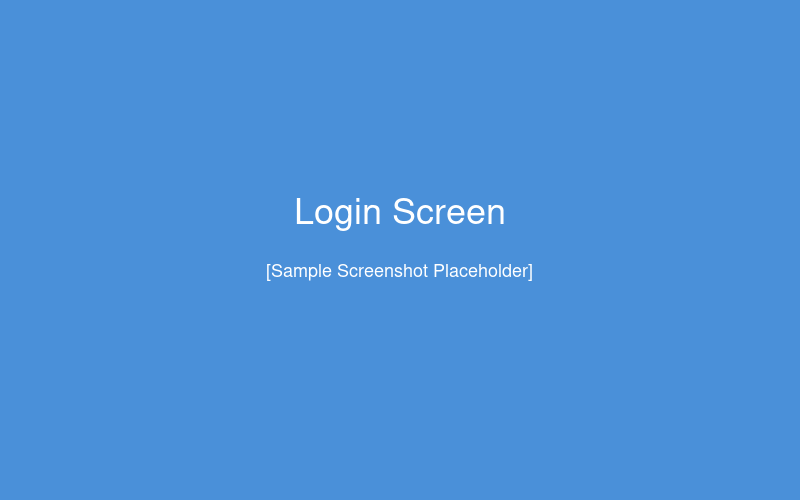

# Overview

This document describes the standard process for submitting, reviewing, and
implementing change requests. It covers the end-to-end workflow from initial
submission through deployment, including roles, responsibilities, and approval
gates. For cost calculations, see [Cost Formulas](#cost-formulas). If a request
stalls, refer to [Escalation Procedures](#escalation-procedures).

For additional context, see the [ITIL Change Management framework](https://www.axelos.com/best-practice-solutions/itil) and our internal [wiki page](https://wiki.example.com/change-management).

## System Architecture

The change request system spans multiple layers of our platform. The diagram
below shows how user-facing applications connect through the API gateway to
backend services and data stores.


## Roles and Responsibilities

| Role              | Responsibility                                    | Approval Authority |
|-------------------|---------------------------------------------------|--------------------|
| Requester         | Submits change request with business justification | N/A                |
| Team Lead         | Reviews and assigns to implementation team         | Initial triage     |
| Developer         | Implements the requested change                    | N/A                |
| QA Engineer       | Validates implementation against requirements      | Quality gate       |
| Change Manager    | Final review and deployment authorization          | Production deploy  |

## Key Terminology

- **CR**: Change Request — a formal proposal to modify a system or process.
- **OTC**: Operational Technology Committee — the governing body that reviews *high-impact* changes.
- **SLA**: Service Level Agreement — the ~~minimum~~ target response time for each stage.

# Process Workflow

The following diagram shows the complete change request lifecycle:


## Step 1 — Submit Request

Navigate to the system portal at `https://changes.example.com` and log in with your credentials.



Fill out the change request form with:

- **Summary**: A brief description of the change (one sentence).
- **Business Justification**: Why this change is needed and what problem it solves.
- **Impact Assessment**: Systems and teams affected by the change.
- **Requested Timeline**: Target date for implementation.

> **Note:** Incomplete submissions will be returned to the requester. Ensure all
> required fields are filled before submitting.

## Step 2 — Triage and Assignment

The Team Lead reviews incoming requests within one business day. During triage:

1. Validate that the request is complete and clearly scoped.
2. Assess priority based on business impact and urgency.
3. Assign the request to the appropriate implementation team.
   - For infrastructure changes, assign to the *Platform Team*.
   - For application changes, assign to the relevant *Product Team*.
   - For database changes, assign to the *DBA Team*.

Requests that do not meet the minimum criteria are returned with feedback.

## Step 3 — Implementation

The assigned developer:

1. Reviews the requirements and creates a work plan.
2. Implements the change in a development environment.
3. Writes or updates automated tests as applicable.
4. Submits the implementation for review.

> **Important:** All changes must be implemented in a non-production environment
> first. Direct changes to production are not permitted.

Configuration changes are applied via the deployment manifest located at:

```
S:\deployments\config\change-requests
```

## Step 4 — Review and QA

After implementation, the QA Engineer verifies the change:

- Functional testing against the original requirements.
- Regression testing to ensure no existing functionality is broken.
- Performance impact assessment if applicable.

After validation, the dashboard provides a summary view of the change status.


The QA environment uses the following validation script:

```python
def validate_change(cr_id: str, environment: str) -> bool:
    """Run the standard validation suite for a change request."""
    cr = fetch_change_request(cr_id)
    results = run_test_suite(cr.test_plan, target=environment)
    return all(r.passed for r in results)
```

## Step 5 — Approval and Deployment

The Change Manager performs a final review:

1. Confirms all QA checks have passed.
2. Verifies deployment plan and rollback procedures are documented.
3. Schedules deployment during the next maintenance window.
4. Authorizes the production deployment.

---

# File Structure

The change management working files are stored at `S:\change-management\2026`. The folder structure is as follows:

```
S:.
├───Active Requests ¹
│   ├───High Priority
│   │   └───Approved
│   ├───Normal Priority
│   │   └───Approved
│   └───Low Priority
├───Archive ²
│   ├───2024
│   └───2025
├───Templates ³
│   ├───Request Forms
│   └───Rollback Plans
└───Reports ⁴
    ├───Monthly Summaries
    └───Audit Trail
```

| Ref | Folder | Description |
|-----|--------|-------------|
| ¹ | Active Requests | Current open change requests organized by priority level |
| ² | Archive | Completed and closed requests from prior years |
| ³ | Templates | Blank forms and standard rollback plan templates |
| ⁴ | Reports | Monthly summary reports and audit trail documentation |

# Escalation Procedures

If a change request is blocked or delayed beyond the target date:

1. **First escalation**: Notify the Team Lead (after 2 business days overdue).
2. **Second escalation**: Notify the Change Manager (after 5 business days overdue).
3. **Third escalation**: Notify the Director of Operations (after 10 business days overdue).

> **Warning:** Escalation timelines are strictly enforced. Failure to escalate
> within the defined windows may result in SLA violations.
>
> Contact the Change Management Office at `change-mgmt@example.com` for
> questions about the escalation process.

# Checklist

Before submitting a change request (see
[Step 1 — Submit Request](#step-1-submit-request)), verify the following:

- [ ] Business justification is documented
- [ ] Impact assessment is complete
- [ ] Rollback plan is attached
- [ ] Test plan is defined
- [ ] Stakeholders have been notified

# Cost Formulas

The budget impact of a change request is calculated as follows. The total cost $C$ is the sum of labor, infrastructure, and overhead:

$$
C = \sum_{i=1}^{n} (h_i \cdot r_i) + I + \alpha \cdot (L + I)
$$

Where:

- $h_i$ = hours for resource $i$, and $r_i$ = hourly rate
- $L = \sum_{i=1}^{n} h_i \cdot r_i$ is the total labor cost
- $I$ = infrastructure cost (hardware, licensing, cloud resources)
- $\alpha$ = overhead rate (currently $\alpha = 0.15$)

For expedited requests, a priority surcharge applies:

$$
C_{\text{expedited}} = C \times \begin{cases}
1.0 & \text{if priority is Low} \\
1.25 & \text{if priority is Normal} \\
1.5 & \text{if priority is High}
\end{cases}
$$

The annualized ROI for an approved change is:

$$
\text{ROI} = \frac{\Delta R - C}{C} \times 100\%
$$

where $\Delta R$ is the projected annual revenue impact or cost savings.

# Revision History

| Version | Date       | Author          | Changes                          |
|---------|------------|-----------------|----------------------------------|
| 1.0     | 2026-02-24 | Operations Team | Initial document release         |
| 1.1     | 2026-02-25 | Operations Team | Added file structure, checklist   |
